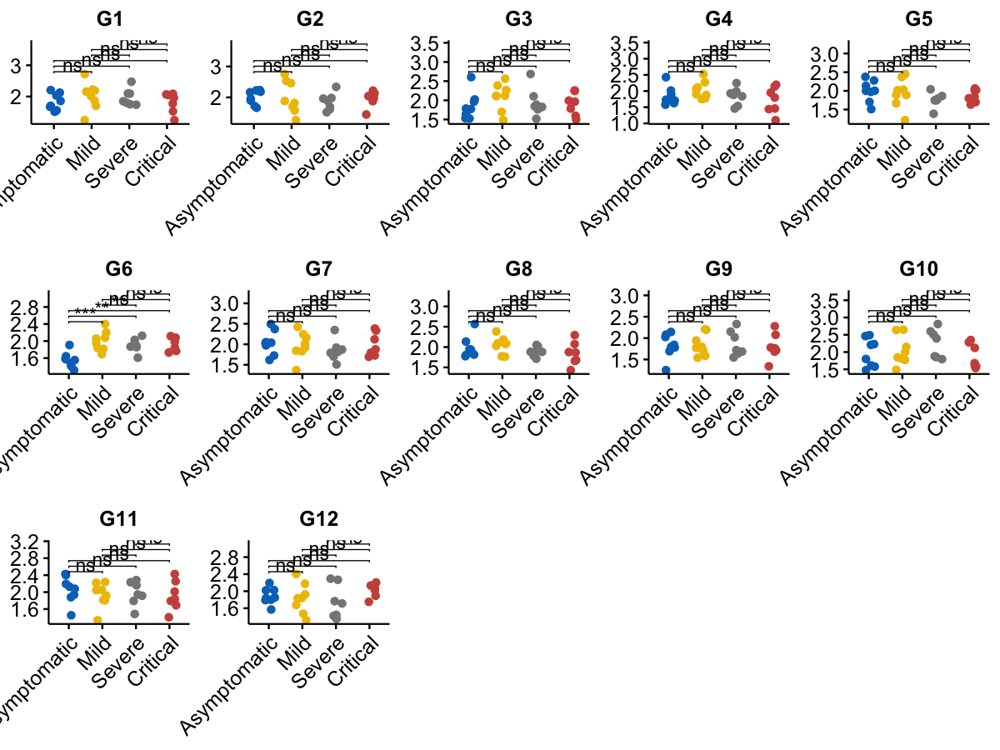

# Batch boxplot with jitter and pairwise comparisons

Create multiple boxplots (one per feature) with jitter points and
pairwise t-test comparisons, arranged in a grid.

## Usage

``` r
plot_batch_boxplot(
  expr,
  group_df,
  sample_col = "sample",
  group_col = "group",
  features = NULL,
  log2_transform = TRUE,
  group_order = NULL,
  comparisons = NULL,
  colors = NULL,
  ncol = 5,
  add_jitter = TRUE,
  return_plots = FALSE
)
```

## Arguments

- expr:

  Expression matrix/data.frame. Rows are features and columns are
  samples.

- group_df:

  data.frame containing sample IDs and group labels.

- sample_col:

  Character. Column name in `group_df` for sample IDs.

- group_col:

  Character. Column name in `group_df` for group labels.

- features:

  Optional character vector of features to plot.

- log2_transform:

  Logical. Whether to apply log2(x + 1).

- group_order:

  Optional character vector specifying group order.

- comparisons:

  Optional list of pairwise comparisons. If NULL, all pairwise
  combinations are used.

- colors:

  Character vector of colors for groups (named or ordered).

- ncol:

  Integer. Number of columns for the grid layout.

- add_jitter:

  Logical. Whether to add jitter points.

- return_plots:

  Logical. If TRUE, return the list of individual plots.

## Value

A list with:

- `grid`: combined plot (cowplot).

- `plots`: list of ggplot objects (if `return_plots = TRUE`).

## Required columns

- expr:

  Rows = features; columns = samples (column names as sample IDs).

- group_df:

  Must contain `sample_col` and `group_col`.

## Examples


