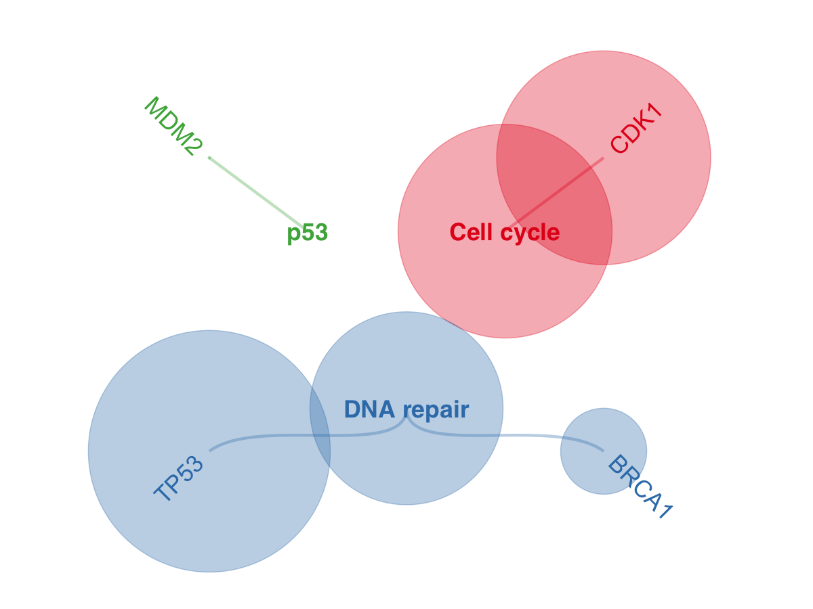

# Circular hierarchical graph (ccgraph)

Plot a circular hierarchical graph using ggraph/tidygraph.

## Usage

``` r
plot_ccgraph(
  df,
  index,
  value = tail(colnames(df), 1),
  root = "all",
  node_color_map = NULL,
  edge_color_by = c("branch", "node_color"),
  palette = "Set1",
  size_range = c(0.5, 80),
  label_size = 6,
  label_family = "sans",
  label_offset = 1.05,
  coord_limit = 1.3,
  save_path = NULL,
  save_width = 14,
  save_height = 14
)
```

## Arguments

- df:

  A data.frame containing hierarchy columns and a value column.

- index:

  Character vector of hierarchy columns (at least two).

- value:

  Character. Column name used for node size (default last column).

- root:

  Character. Optional root node name.

- node_color_map:

  Named vector for highlighting node colors by short name.

- edge_color_by:

  Character. Either `"branch"` or `"node_color"`.

- palette:

  Character. Color palette for branches (e.g., `"Set1"`).

- size_range:

  Numeric length-2. Point size range.

- label_size:

  Numeric. Text size for labels.

- label_family:

  Character. Font family for labels.

- label_offset:

  Numeric. Label radius multiplier.

- coord_limit:

  Numeric. Coordinate limit for x/y.

- save_path:

  Character. If provided, save plot via `ggsave()`.

- save_width:

  Numeric. Width passed to `ggsave()`.

- save_height:

  Numeric. Height passed to `ggsave()`.

## Value

A ggplot object.

## Required columns

- index:

  Hierarchy columns in `df` (at least two).

- value:

  Numeric column used for node size.

## Examples


