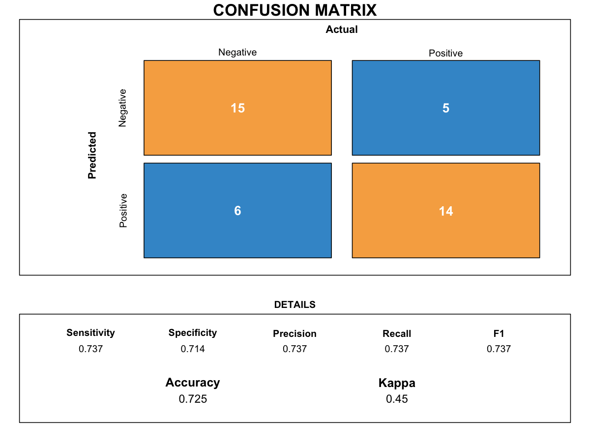

# Plot a custom confusion matrix

Draw a stylized confusion matrix using a
[`caret::confusionMatrix`](https://rdrr.io/pkg/caret/man/confusionMatrix.html)
object.

## Usage

``` r
plot_confusion_matrix_custom(
  cm,
  save_path = NULL,
  save_width = 5.5,
  save_height = 6
)
```

## Arguments

- cm:

  A
  [`caret::confusionMatrix`](https://rdrr.io/pkg/caret/man/confusionMatrix.html)
  object.

- save_path:

  Character. If provided, save plot to file (PDF/PNG).

- save_width:

  Numeric. Width of output.

- save_height:

  Numeric. Height of output.

## Value

NULL (invisibly).

## Required inputs

- cm:

  A
  [`caret::confusionMatrix`](https://rdrr.io/pkg/caret/man/confusionMatrix.html)
  object.

## Examples


