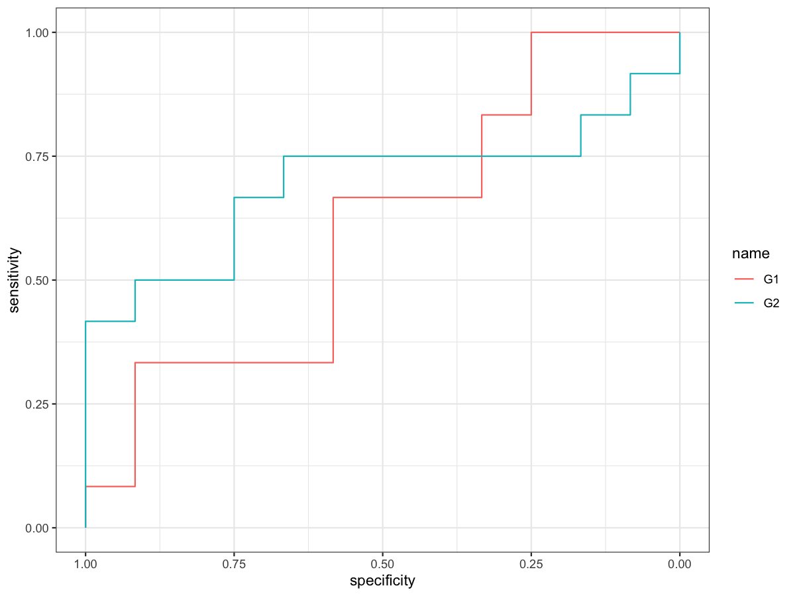

# Diagnostic ROC Analysis

Plot single-gene ROC curves and a combined ROC figure for multiple
genes.

## Usage

``` r
plot_diagnostic_roc(
  expr,
  group_df,
  target_genes,
  project_name = "ROC_Analysis",
  sample_col = NULL,
  group_col = "group",
  case_label = "Case"
)
```

## Arguments

- expr:

  Expression matrix (genes x samples). Row names are gene IDs and column
  names are sample IDs.

- group_df:

  Sample metadata with sample IDs and group labels.

- target_genes:

  Target gene vector.

- project_name:

  Project name for output files.

- sample_col:

  Optional column in \`group_df\` for sample IDs. If \`NULL\`, row names
  of \`group_df\` are used.

- group_col:

  Column in \`group_df\` with group labels.

- case_label:

  Case label (positive class).

## Value

A named list of ROC objects.

## Required columns

- expr:

  Rows = genes; columns = samples.

- group_df:

  Must contain `sample_col` (or rownames) and `group_col`.

## Examples


