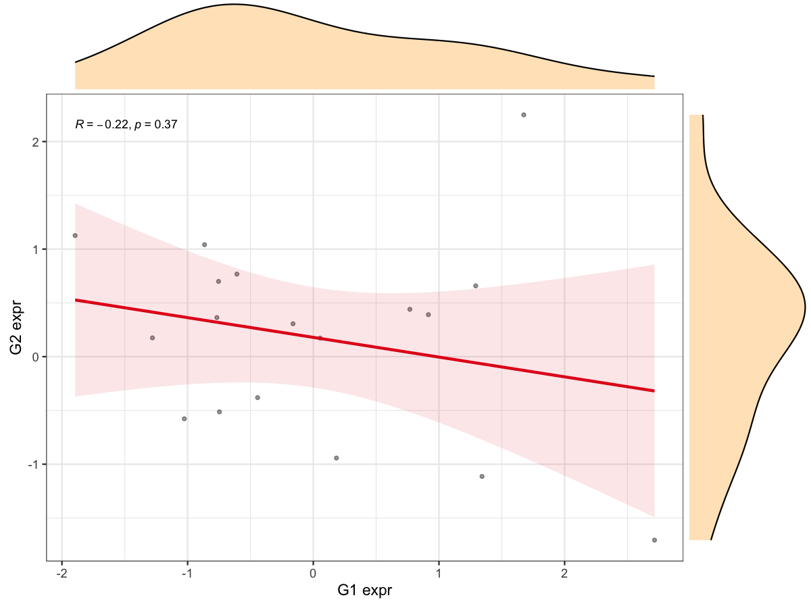

# Parallel Correlation of Target Gene vs DEG Set

Compute correlations between a target gene and all DEGs and save
significant plots.

## Usage

``` r
plot_gene_deg_cor_parallel(
  expr,
  target_gene,
  deg_table,
  workers = 10,
  base_dir = "DEG_Cor_Plots",
  p_cutoff = 0.05,
  save_plot = TRUE,
  return_plots = FALSE,
  max_plots = 10
)
```

## Arguments

- expr:

  Expression matrix (genes x samples). Row names are gene IDs and column
  names are sample IDs.

- target_gene:

  Target gene name.

- deg_table:

  Differential expression table with \`gene\` and \`change\` columns
  (change: up/down/stable).

- workers:

  Number of parallel workers.

- base_dir:

  Base output directory prefix.

- p_cutoff:

  P-value cutoff for significance.

- save_plot:

  Logical. Whether to save plots to PDF files.

- return_plots:

  Logical. Whether to return ggplot objects for significant pairs.

- max_plots:

  Integer. Maximum number of plots to return.

## Value

If `return_plots = TRUE`, returns a list of ggplot objects. Otherwise,
invisibly returns the output directory.

## Required columns

- expr:

  Rows = genes; columns = samples.

- deg_table:

  Must contain columns `gene` and `change`.

## Examples


