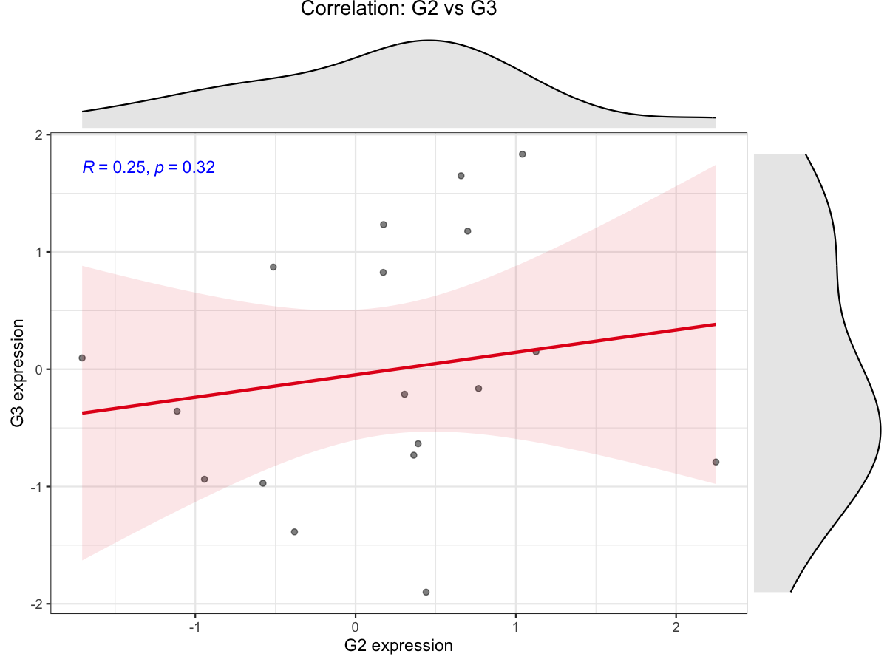

# Gene Pair Correlation Plot

Plot correlation between two genes and save a PDF if significant.

## Usage

``` r
plot_gene_pair_cor(
  expr,
  gene1,
  gene2,
  base_dir = "Single_Gene_Cor",
  p_cutoff = 0.05,
  save_plot = TRUE,
  return_plot = FALSE
)
```

## Arguments

- expr:

  Expression matrix (genes x samples). Row names are gene IDs and column
  names are sample IDs.

- gene1:

  First gene name.

- gene2:

  Second gene name.

- base_dir:

  Base output directory prefix.

- p_cutoff:

  P-value cutoff for significance.

- save_plot:

  Logical. Whether to save plot to PDF when significant.

- return_plot:

  Logical. Whether to return the ggplot object when significant.

## Value

If `return_plot = TRUE`, returns the ggplot object when significant;
otherwise invisibly returns the output directory when saved.

## Required columns

- expr:

  Rows = genes; columns = samples.

## Examples


