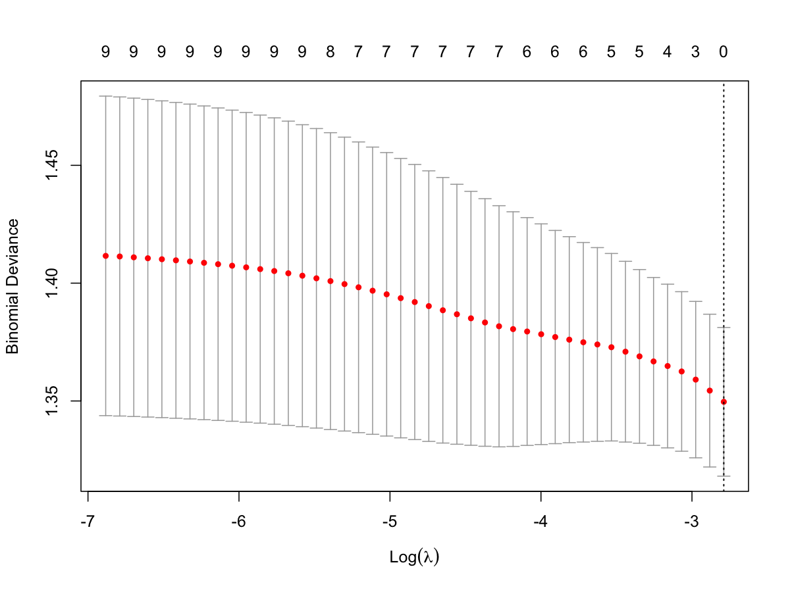

# glmnet Plots (CV Curve and Coefficient Path)

Save cross-validation curve and coefficient path plots from a cv.glmnet
fit.

## Usage

``` r
plot_glmnet_cvpath(
  cv_fit,
  out_dir = ".",
  prefix = "ElasticNet",
  plots = c("cv", "path"),
  lambda = NULL,
  width = 6,
  height = 5
)
```

## Arguments

- cv_fit:

  A \`cv.glmnet\` object.

- out_dir:

  Output directory.

- prefix:

  File name prefix.

- plots:

  Which plots to save: \`"cv"\`, \`"path"\`, or both.

- lambda:

  Optional lambda value for vertical line (default: \`lambda.min\`).

- width:

  Plot width in inches.

- height:

  Plot height in inches.

## Value

A list with file paths for the saved plots.

## Required columns

Not applicable. `cv_fit` should be a `cv.glmnet` object from
[`glmnet::cv.glmnet`](https://rdrr.io/pkg/glmnet/man/cv.glmnet.html) or
`Epi_ElasticNet`.

## Examples


