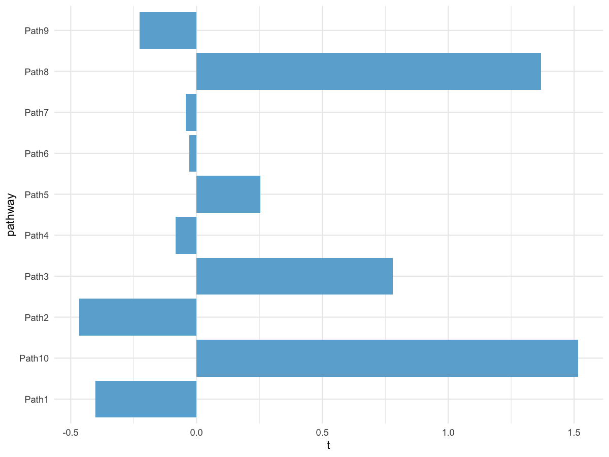

# GSVA + limma pathway analysis with diverging barplot

Run GSVA on expression data, perform limma differential analysis, and
plot a diverging bar chart based on t statistics.

## Usage

``` r
plot_gsva_limma_barplot(
  expr,
  gene_sets,
  group,
  sample_col = "sample",
  group_col = "group",
  group_levels = NULL,
  contrast = NULL,
  mx.diff = TRUE,
  kcdf = "Gaussian",
  parallel_sz = 4,
  top_n = 200,
  strip_prefix = "HALLMARK_",
  t_cutoff = 2,
  palette = c(Up = "#36638a", NoSignifi = "#cccccc", Down = "#7bcd7b"),
  label = TRUE,
  save_path = NULL,
  save_width = 8,
  save_height = 8
)
```

## Arguments

- expr:

  Matrix/data.frame. Genes x samples expression matrix.

- gene_sets:

  Either a list of gene sets or a path to a GMT file.

- group:

  Vector or data.frame defining sample groups. If vector, length must
  equal number of samples. If data.frame, provide `sample_col` and
  `group_col`.

- sample_col:

  Character. Sample ID column in `group` data.frame.

- group_col:

  Character. Group label column in `group` data.frame.

- group_levels:

  Character vector. Group order for contrasts.

- contrast:

  Character length-2. Contrast in the order c(group1, group2)
  corresponding to group1 - group2.

- mx.diff:

  Logical. GSVA mx.diff parameter.

- kcdf:

  Character. GSVA kcdf ("Gaussian" or "Poisson").

- parallel_sz:

  Integer. GSVA parallel size.

- top_n:

  Integer. Number of pathways to keep in limma table.

- strip_prefix:

  Character. Prefix to remove from pathway IDs.

- t_cutoff:

  Numeric. Threshold for up/down classification.

- palette:

  Named vector for Up/Down/NoSignifi colors.

- label:

  Logical. Whether to add labels on bars.

- save_path:

  Character. If provided, save plot via `ggsave()`.

- save_width:

  Numeric. Width for saved plot.

- save_height:

  Numeric. Height for saved plot.

## Value

A list with:

- `gsva`: GSVA score matrix.

- `limma`: limma differential table.

- `plot_data`: data used for plotting.

- `plot`: ggplot object.

## Required columns

- expr:

  Rows = genes; columns = samples.

- group:

  If data.frame, must contain `sample_col` and `group_col`.

## Examples


