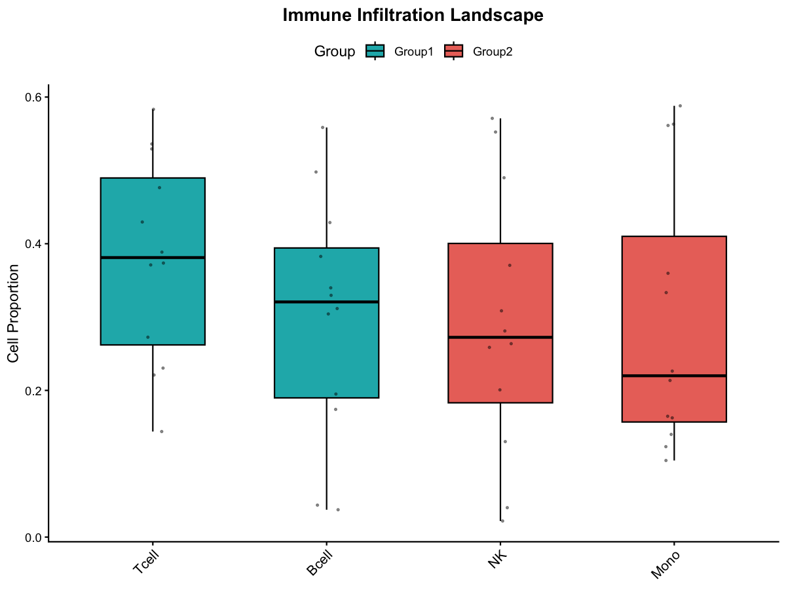

# Immune Infiltration Boxplot

Plot group-wise immune cell composition boxplots.

## Usage

``` r
plot_imm_boxplot(imm_long_data, colors = c("#1CB4B8", "#EB7369"))
```

## Arguments

- imm_long_data:

  Long-format data from \`Bio_Bulk_cibersort_analysis\`. Required
  columns: \`Sample\`, \`Group\`, \`CellType\`, \`Composition\`.

- colors:

  Fill colors for groups.

## Value

A ggplot object.

## Required columns

- Sample:

  Sample ID.

- Group:

  Group label.

- CellType:

  Immune cell type.

- Composition:

  Cell proportion.

## Examples


