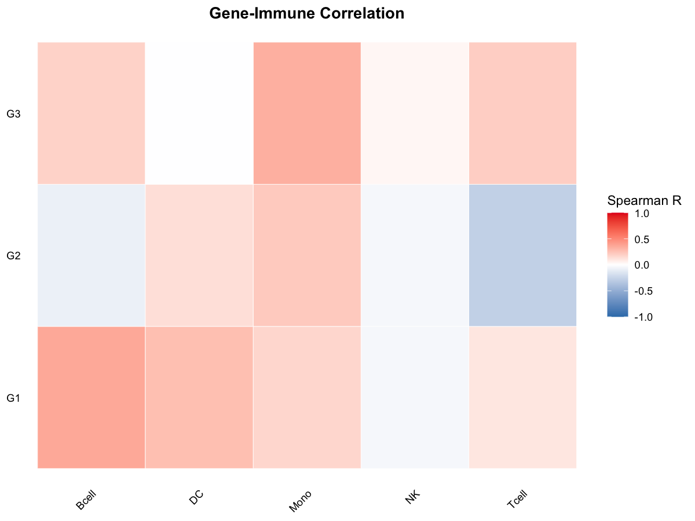

# Gene-Immune Correlation Heatmap

Plot a heatmap of gene-immune cell correlations with significance stars.

## Usage

``` r
plot_imm_cor_heatmap(imm_wide_data, expr_matrix, genes)
```

## Arguments

- imm_wide_data:

  Immune infiltration matrix (samples x cell types). Row names are
  sample IDs and columns are immune cell types.

- expr_matrix:

  Expression matrix (genes x samples). Row names are gene IDs and column
  names are sample IDs.

- genes:

  Character vector of target genes.

## Value

A ggplot object.

## Required columns

- imm_wide_data:

  Rows = samples; columns = immune cell types.

- expr_matrix:

  Rows = genes; columns = samples.

## Examples


