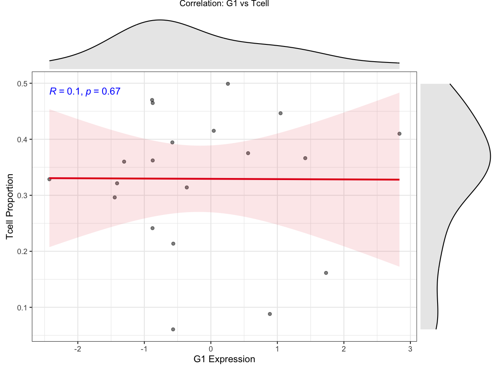

# Significant Immune Correlation Scatterplots

Generate scatter plots for immune cell proportions significantly
correlated with a target gene.

## Usage

``` r
plot_imm_sig_scatters(
  imm_wide_data,
  expr_matrix,
  gene,
  base_dir = "Correlation_Plots",
  p_cutoff = 0.05,
  save_plot = TRUE,
  return_plots = FALSE,
  max_plots = 10
)
```

## Arguments

- imm_wide_data:

  Immune infiltration matrix (samples x cell types). Row names are
  sample IDs and columns are immune cell types.

- expr_matrix:

  Expression matrix (genes x samples). Row names are gene IDs and column
  names are sample IDs.

- gene:

  Target gene name.

- base_dir:

  Base output directory prefix.

- p_cutoff:

  P-value cutoff for significance.

- save_plot:

  Logical. Whether to save plots to PDF files.

- return_plots:

  Logical. Whether to return ggplot objects for significant pairs.

- max_plots:

  Integer. Maximum number of plots to return (when
  `return_plots = TRUE`).

## Value

If `return_plots = TRUE`, returns a list of ggplot objects. Otherwise,
invisibly returns the output directory path.

## Required columns

- imm_wide_data:

  Rows = samples; columns = immune cell types.

- expr_matrix:

  Rows = genes; columns = samples.

## Examples


