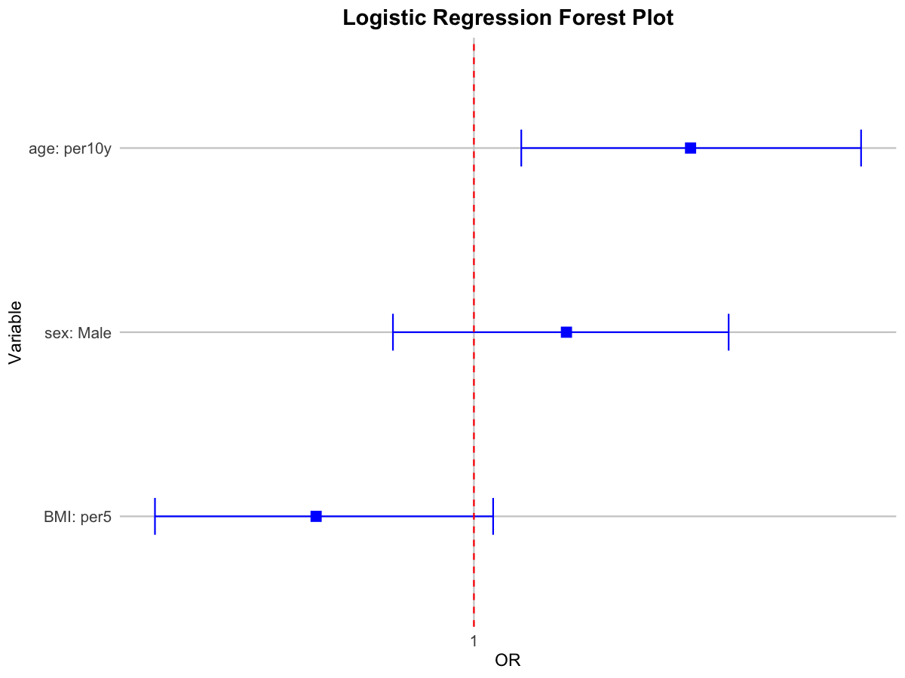

# Forest Plot for Logistic Regression Results

Create a forest plot from logistic regression results (OR and 95

## Usage

``` r
plot_logistic_forest(
  result_df,
  title = "Logistic Regression Forest Plot",
  color = "blue",
  log_scale = TRUE,
  breaks = c(0.5, 1, 2, 4, 8)
)
```

## Arguments

- result_df:

  A data frame with columns: variable, level, OR, OR_95CI.

- title:

  Plot title.

- color:

  Point/CI color.

- log_scale:

  Logical; use log10 scale for OR axis.

- breaks:

  Optional numeric breaks for OR axis.

## Value

A ggplot object.

## Required columns

- variable:

  Variable name.

- level:

  Level name.

- OR:

  Odds ratio (numeric).

- OR_95CI:

  Confidence interval string like "0.8-1.2".

## Examples


