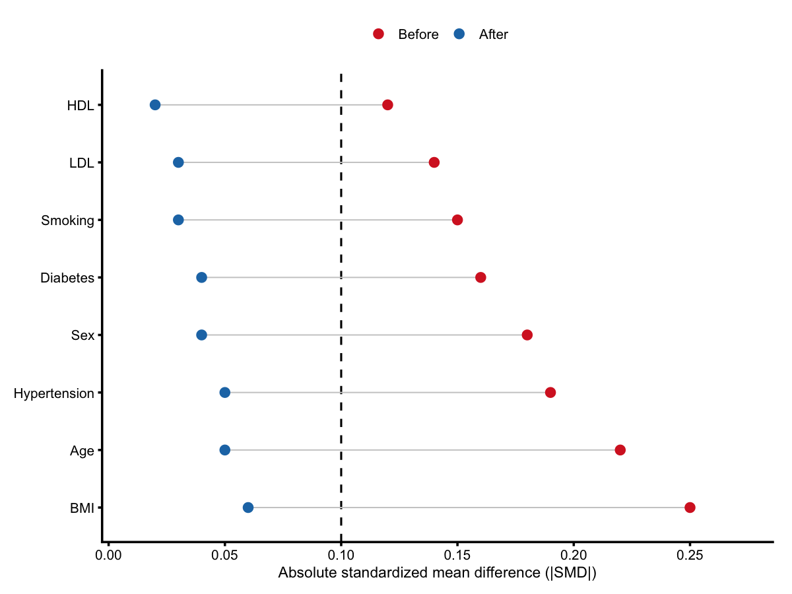

# Love Plot for Absolute Standardized Mean Differences

Create a love plot comparing absolute SMDs before and after adjustment.

## Usage

``` r
plot_love(
  data,
  covariate_col = "Covariate",
  before_col = "AbsSMD_Before_max",
  after_col = "AbsSMD_After_max",
  threshold = 0.1,
  colors = c(Before = "#D62728", After = "#1F77B4"),
  connect_lines = TRUE,
  x_breaks = seq(0, 0.3, by = 0.05),
  x_limit = NULL,
  base_size = 12
)
```

## Arguments

- data:

  A data frame containing covariate and SMD columns. Required columns
  (or mapped via \`\*\_col\`): covariate name, absolute SMD before, and
  absolute SMD after.

- covariate_col:

  Column name for covariates.

- before_col:

  Column name for "before" absolute SMD values.

- after_col:

  Column name for "after" absolute SMD values.

- threshold:

  Numeric threshold for the vertical reference line.

- colors:

  Named vector for point colors, with names \`Before\` and \`After\`.

- connect_lines:

  Logical; draw connecting lines between before/after points.

- x_breaks:

  Numeric vector of x-axis breaks.

- x_limit:

  Numeric length-2 vector for x limits. If \`NULL\`, computed from data.

- base_size:

  Base font size for the theme.

## Value

A list with:

- plot:

  A \`ggplot\` object.

- data:

  A list with \`summary\` and \`long\` data frames.

## Required columns

- Covariate:

  Covariate name (or set `covariate_col`).

- AbsSMD_Before_max:

  Absolute SMD before (or set `before_col`).

- AbsSMD_After_max:

  Absolute SMD after (or set `after_col`).

## Examples


