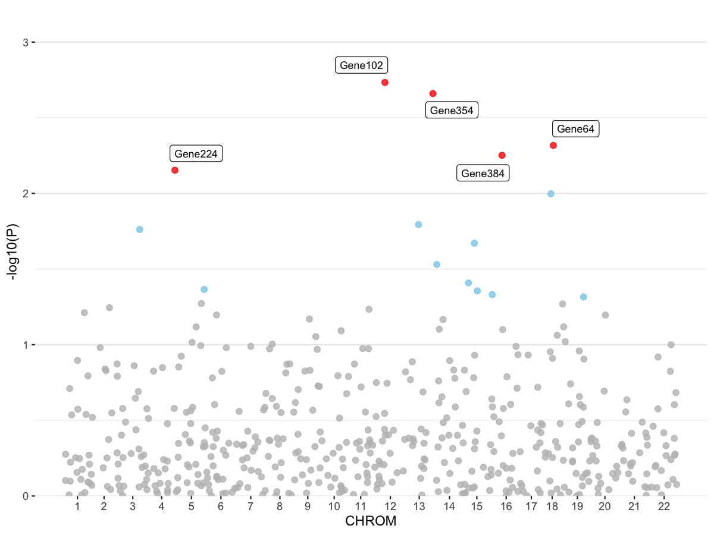

# Manhattan Plot With Built-In Data Processing

Create a Manhattan plot from summary statistics. Data processing and
plotting are integrated into one function, with either a
chromosome-colored or a simple highlight style.

## Usage

``` r
plot_manhattan(
  res,
  chr_col = "CHR",
  pos_col = "BP",
  gene_col = "gene",
  p_col = "P",
  trait = NULL,
  top_num = 25,
  style = c("color", "simple"),
  p_adjust = c("Bon"),
  anno = FALSE,
  gene_type = c("ENSG"),
  gene_anno = NULL,
  highlight = TRUE
)
```

## Arguments

- res:

  A data frame containing GWAS/TWAS summary statistics. Required columns
  (or mapped via \`\*\_col\`): chromosome (\`CHR\`), position (\`BP\`),
  gene ID (\`gene\`), and P-value (\`P\`).

- chr_col:

  Column name for chromosome.

- pos_col:

  Column name for base-pair position.

- gene_col:

  Column name for gene identifier.

- p_col:

  Column name for P-value.

- trait:

  Optional plot title.

- top_num:

  Number of top signals to annotate.

- style:

  Plot style: \`"color"\` (chromosome-colored) or \`"simple"\`.

- p_adjust:

  P-value adjustment method for threshold line. Only \`"Bon"\`
  (Bonferroni) is supported.

- anno:

  Logical; whether to map gene IDs to symbols.

- gene_type:

  Gene ID type for annotation. Currently supports \`"ENSG"\`.

- gene_anno:

  Optional data frame for gene annotation. If \`NULL\` and \`anno =
  TRUE\`, this loads \`gene_anno_hg38\` from the package. You can also
  pass \`gene_anno_hg37\` (hg37) or your own data frame. For \`ENSG\`,
  required columns are \`Gene stable ID\` and \`HGNC symbol\`.

- highlight:

  Logical; whether to draw the Bonferroni threshold line.

## Value

A \`ggplot\` object.

## Required columns

- CHR:

  Chromosome (numeric/integer).

- BP:

  Base-pair position (numeric).

- gene:

  Gene ID or symbol.

- P:

  P-value.

## Examples


