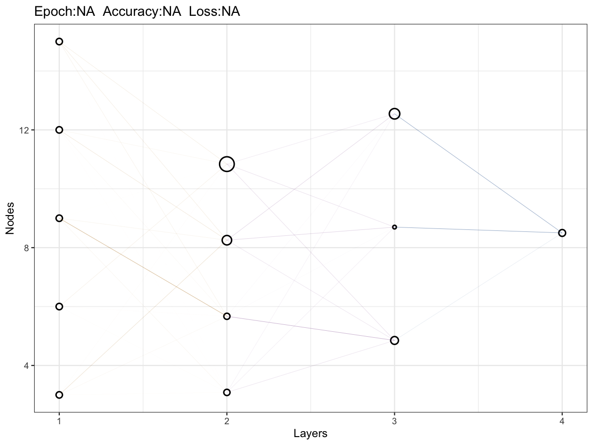

# Plot MLP network structure

Visualize a multilayer perceptron (MLP) structure using node sizes and
edge transparency derived from weights/biases.

## Usage

``` r
plot_mlp_network(
  weights,
  biases,
  layer_units,
  epoch = NA,
  accuracy = NA,
  loss = NA,
  netcolor = c("#AE7000", "#925E9F", "#00468B", "#ED0000"),
  save_path = NULL,
  save_width = 7.5,
  save_height = 5.5
)
```

## Arguments

- weights:

  List of weight matrices (layer-wise).

- biases:

  List of bias vectors (layer-wise).

- layer_units:

  Integer vector. Nodes per layer, including input and output.

- epoch:

  Integer. Epoch used for annotation.

- accuracy:

  Numeric. Accuracy used for annotation.

- loss:

  Numeric. Loss used for annotation.

- netcolor:

  Character vector. Colors for edges by layer.

- save_path:

  Character. If provided, save plot via `ggsave()`.

- save_width:

  Numeric. Width passed to `ggsave()`.

- save_height:

  Numeric. Height passed to `ggsave()`.

## Value

A ggplot object.

## Required inputs

- weights:

  List of weight matrices, one per layer (input-\>hidden,
  hidden-\>hidden, hidden-\>output).

- biases:

  List of bias vectors, one per layer (excluding input layer).

- layer_units:

  Integer vector of layer sizes including input and output.

## Examples


