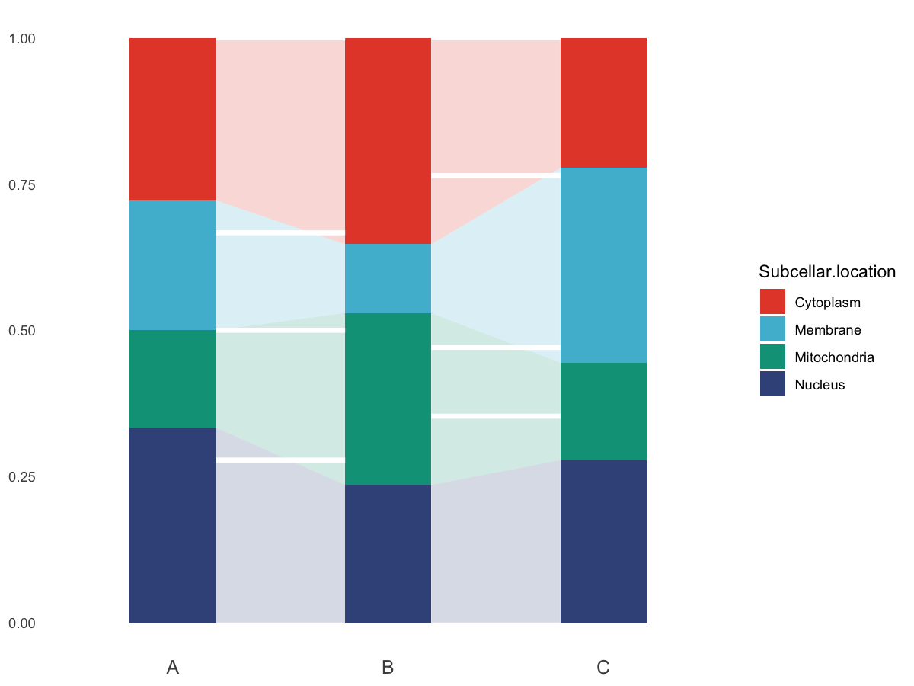

# Mulberry (alluvial) plot

Create a mulberry-style alluvial plot for compositional data across
samples.

## Usage

``` r
plot_mulberry(
  data,
  location_col = "Subcellar.location",
  sample_cols = NULL,
  colors = NULL,
  bar_width = 0.4,
  flow_alpha = 0.2,
  add_separators = TRUE,
  separator_color = "white",
  separator_size = 1.5,
  show_legend = TRUE,
  show_pies = FALSE,
  pie_template = "blue1",
  pie_title_size = 15,
  save_path = NULL,
  save_width = 6,
  save_height = 4
)
```

## Arguments

- data:

  A data.frame in wide format.

- location_col:

  Character. Column name for category (e.g. subcellular location).

- sample_cols:

  Character vector of sample columns. If NULL, use all columns except
  `location_col`.

- colors:

  Optional named vector of colors for categories.

- bar_width:

  Numeric. Width of bars/flows.

- flow_alpha:

  Numeric. Transparency for flows.

- add_separators:

  Logical. Whether to draw separator segments between samples.

- separator_color:

  Character. Separator line color.

- separator_size:

  Numeric. Separator line size.

- show_legend:

  Logical. Whether to show legend.

- show_pies:

  Logical. Whether to generate pie charts for each sample.

- pie_template:

  Character. Template name for `tastypie::pie_bake`.

- pie_title_size:

  Numeric. Title size for pies.

- save_path:

  Character. If provided, save plot via `ggsave()`.

- save_width:

  Numeric. Width for saved plot.

- save_height:

  Numeric. Height for saved plot.

## Value

A list with:

- `plot`: ggplot object.

- `data`: long-format data with proportions.

- `pies`: list of pie plots (if `show_pies = TRUE`).

## Required columns

- location_col:

  Category column (e.g. subcellular location).

- sample_cols:

  Sample columns with counts/abundance.

## Examples


