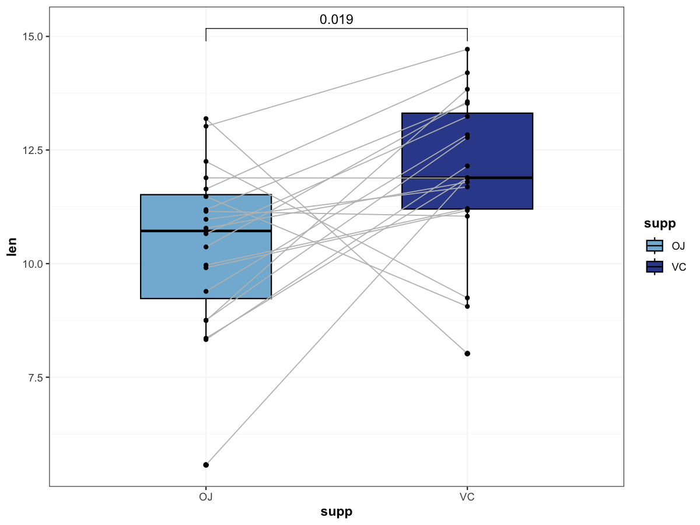

# Paired boxplot with paired test

Create paired boxplots with jittered points and paired statistical test.

## Usage

``` r
plot_paired_boxplot(
  data,
  x_col = "supp",
  y_col = "len",
  id_col = "id",
  palette = c("#83B8D7", "#354B99"),
  test_method = "wilcox",
  comparisons = list(c("OJ", "VC")),
  add_jitter = TRUE,
  line_color = "gray",
  line_size = 0.4,
  xlab = NULL,
  ylab = NULL,
  title = NULL,
  save_path = NULL,
  save_width = 6,
  save_height = 6
)
```

## Arguments

- data:

  data.frame containing paired measurements.

- x_col:

  Character. Grouping column (paired groups).

- y_col:

  Character. Numeric value column.

- id_col:

  Character. Subject ID column.

- palette:

  Character vector of fill colors.

- test_method:

  Character. Statistical test method (e.g., "wilcox", "t.test").

- comparisons:

  List of comparisons for `stat_compare_means`.

- add_jitter:

  Logical. Whether to add jittered points.

- line_color:

  Character. Line color for pairing.

- line_size:

  Numeric. Line size for pairing.

- xlab:

  Character. X-axis label.

- ylab:

  Character. Y-axis label.

- title:

  Character. Plot title.

- save_path:

  Character. If provided, save plot via `ggsave()`.

- save_width:

  Numeric. Width for saved plot.

- save_height:

  Numeric. Height for saved plot.

## Value

A ggplot object.

## Required columns

- x_col:

  Paired group column.

- y_col:

  Numeric value column.

- id_col:

  Subject ID column.

## Examples


