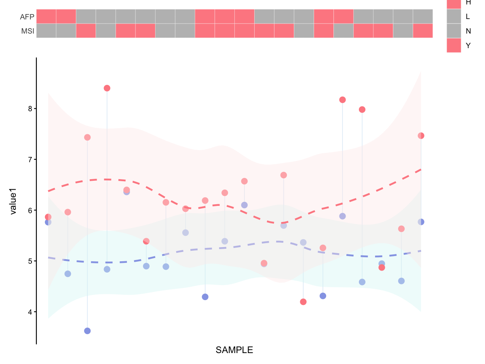

# Paired dumbbell + heatmap combined plot

Create a composite plot with a categorical heatmap (top) and paired
dumbbell/loess curves (bottom).

## Usage

``` r
plot_paired_dumbbell_heat(
  data,
  sample_col = "SAMPLE",
  order_col = "AFPVALUE",
  heat_cols = c("MSI", "AFP"),
  value1_col = "value1",
  value2_col = "value2",
  heat_colors = c(H = "#FE8B91", L = "gray", Y = "#FE8B91", N = "gray"),
  line_color1 = "#96A6E7",
  line_color2 = "#FE8B91",
  smooth_method = "loess",
  smooth_level = 0.95,
  heights = c(0.1, 1),
  save_path = NULL,
  save_width = 8,
  save_height = 6
)
```

## Arguments

- data:

  data.frame containing sample-level values.

- sample_col:

  Character. Sample column name.

- order_col:

  Character. Column used to order samples.

- heat_cols:

  Character vector of categorical columns for the heatmap.

- value1_col:

  Character. First continuous value column.

- value2_col:

  Character. Second continuous value column.

- heat_colors:

  Named vector of colors for heatmap categories.

- line_color1:

  Character. Color for value1 points/curve.

- line_color2:

  Character. Color for value2 points/curve.

- smooth_method:

  Character. Smoother method, default "loess".

- smooth_level:

  Numeric. Confidence level for smooth.

- heights:

  Numeric vector of length 2 for patchwork heights.

- save_path:

  Character. If provided, save plot via `ggsave()`.

- save_width:

  Numeric. Width for saved plot.

- save_height:

  Numeric. Height for saved plot.

## Value

A patchwork plot object.

## Required columns

- sample_col:

  Sample ID column.

- order_col:

  Column used for ordering samples.

- heat_cols:

  Categorical columns for heatmap.

- value1_col:

  First continuous value column.

- value2_col:

  Second continuous value column.

## Examples


