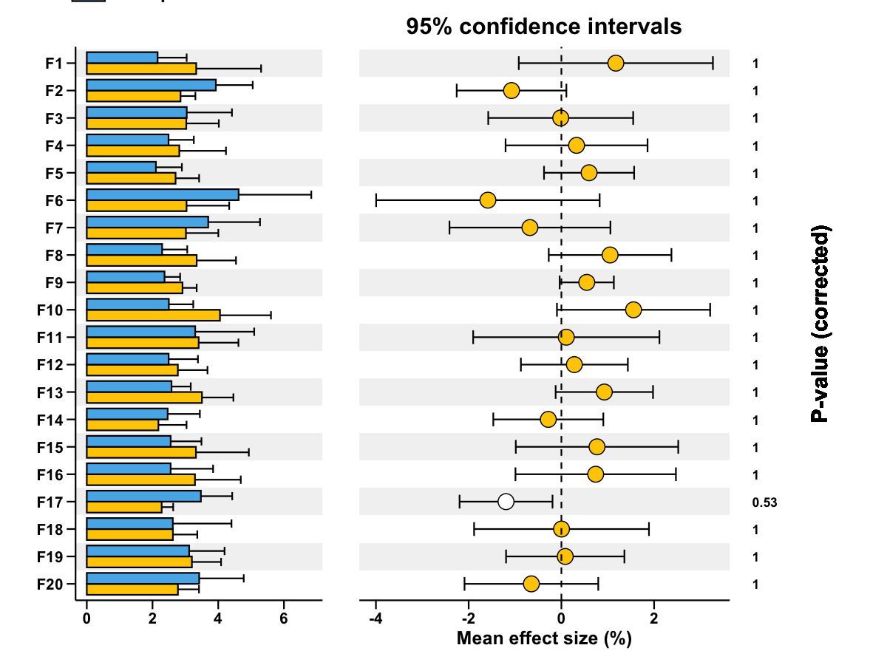

# Post-hoc extended error bar plot

Generate a composite plot with group means (bar), effect size with CI,
and corrected p-values for multiple features.

## Usage

``` r
plot_posthoc_extended_errorbar(
  data,
  group,
  sample_col = "sample",
  group_col = "group",
  min_row_mean = 1,
  adjust_method = "bonferroni",
  palette_bar = c("#FFCC00", "#56B4E9"),
  palette_effect = c("#FFCC00", "white", "#56B4E9"),
  save_path = NULL,
  save_width = 10,
  save_height = 4
)
```

## Arguments

- data:

  Matrix/data.frame of features x samples (or samples x features).

- group:

  Vector or data.frame with group labels for samples.

- sample_col:

  Character. Sample ID column in `group` data.frame.

- group_col:

  Character. Group label column in `group` data.frame.

- min_row_mean:

  Numeric. Filter features with mean \<= this value.

- adjust_method:

  Character. P-value adjustment method.

- palette_bar:

  Character vector of colors for groups in bar plot.

- palette_effect:

  Character vector of colors for effect plot.

- save_path:

  Character. If provided, save plot via `ggsave()`.

- save_width:

  Numeric. Width for saved plot.

- save_height:

  Numeric. Height for saved plot.

## Value

A list with:

- `plot`: combined patchwork plot.

- `diff`: t-test results table.

- `bar_data`: summary for bar plot.

- `effect_data`: effect size table.

## Required columns

- data:

  Rows = features; columns = samples.

- group:

  If data.frame, must contain `sample_col` and `group_col`.

## Examples


