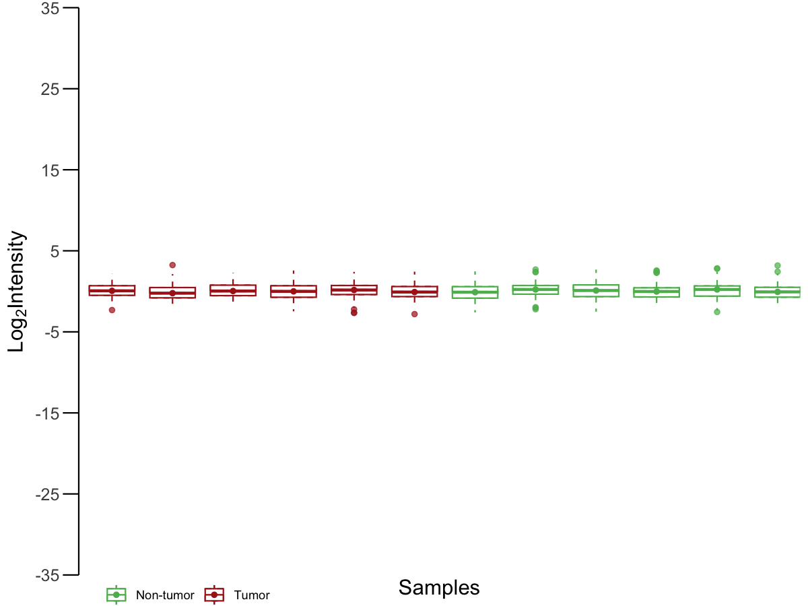

# QC boxplot for sample intensity

Create a quality-control boxplot of sample intensities with per-sample
median.

## Usage

``` r
plot_qc_boxplot(
  expr,
  group_df,
  sample_col = "sample",
  group_col = "group",
  colors = c(Tumor = "#AB201D", `Non-tumor` = "#5CB85C"),
  y_breaks = seq(-35, 35, 10),
  y_limits = c(-35, 35),
  show_x = FALSE,
  save_path = NULL,
  save_width = 12,
  save_height = 3
)
```

## Arguments

- expr:

  Matrix/data.frame with features in rows and samples in columns.

- group_df:

  data.frame containing sample group labels.

- sample_col:

  Character. Sample ID column in `group_df`.

- group_col:

  Character. Group label column in `group_df`.

- colors:

  Named vector of colors for groups.

- y_breaks:

  Numeric vector of y-axis breaks.

- y_limits:

  Numeric length-2 for y limits.

- show_x:

  Logical. Whether to show x-axis labels.

- save_path:

  Character. If provided, save plot via `ggsave()`.

- save_width:

  Numeric. Width for saved plot.

- save_height:

  Numeric. Height for saved plot.

## Value

A list with:

- `plot`: ggplot object.

- `data`: long-format data with medians.

## Required columns

- expr:

  Rows = features; columns = samples.

- group_df:

  Must contain `sample_col` and `group_col`.

## Examples


