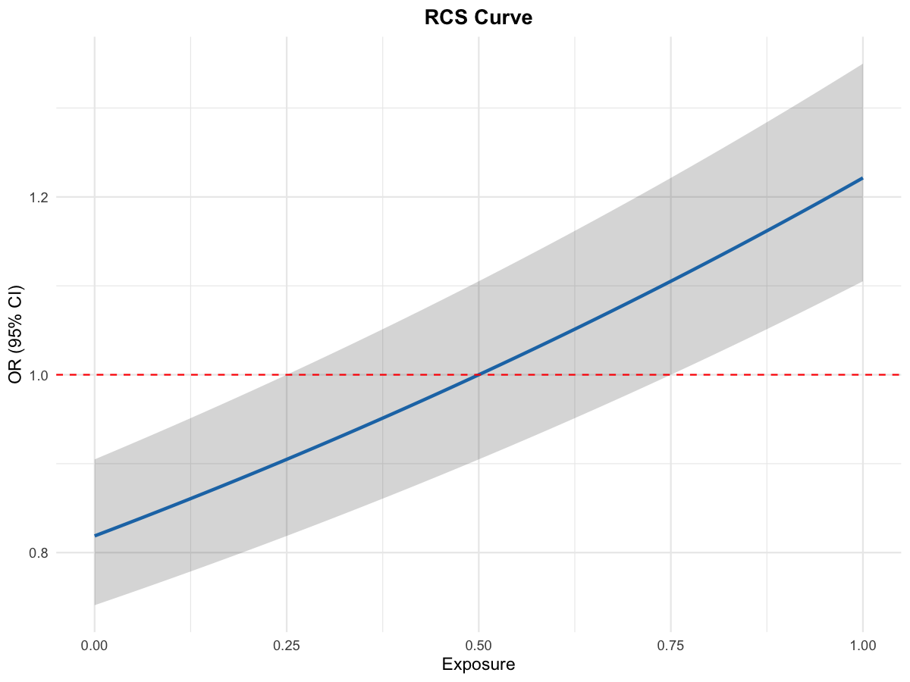

# Plot RCS Curve

Plot RCS curve with confidence interval from \`Epi_RCS_analysis\`
output.

## Usage

``` r
plot_rcs_curve(
  plot_data,
  title = "RCS Curve",
  xlab = "Exposure",
  ylab = "OR (95% CI)",
  use_interactionRCS = FALSE
)
```

## Arguments

- plot_data:

  Data frame with columns: Value, estimate, CI_L, CI_U.

- title:

  Plot title.

- xlab:

  X-axis label.

- ylab:

  Y-axis label.

- use_interactionRCS:

  Use \`interactionRCS::plotINT\` when available.

## Value

A ggplot object (if ggplot2 path) or the interactionRCS plot.

## Required columns

- Value:

  Exposure values.

- estimate:

  Estimated effect.

- CI_L:

  Lower confidence bound.

- CI_U:

  Upper confidence bound.

## Examples


