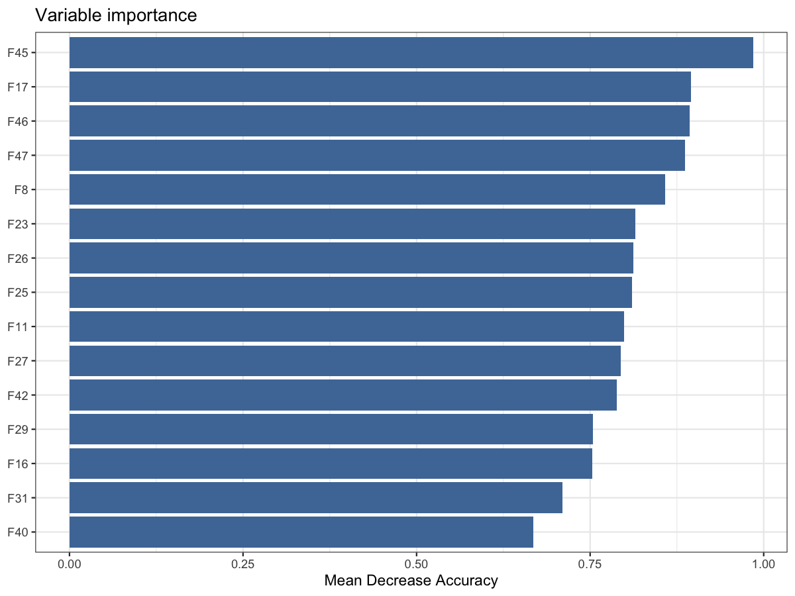

# Plot variable importance from a random forest model

Plot variable importance from a random forest model

## Usage

``` r
plot_rf_importance(
  model,
  top_n = 20,
  fill = "#4E79A7",
  title = "Variable importance"
)
```

## Arguments

- model:

  A `randomForest` model or a data.frame with columns `feature` and
  `importance`.

- top_n:

  Integer. Number of top features to display.

- fill:

  Character. Bar fill color.

- title:

  Character. Plot title.

## Value

A ggplot object.

## Required inputs

Provide either a `randomForest` model or a data.frame with columns
`feature` and `importance`.

## Examples


