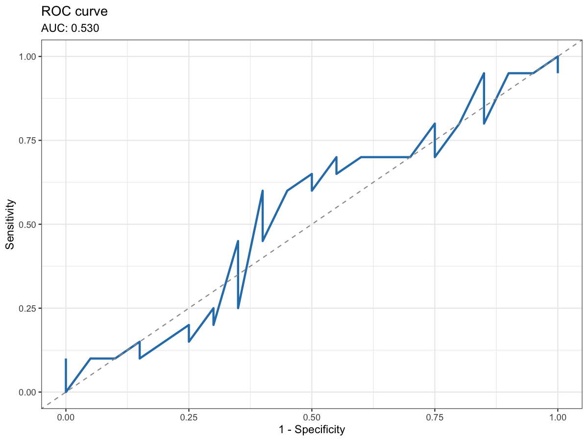

# Plot ROC curve for random forest predictions

Plot ROC curve for random forest predictions

## Usage

``` r
plot_rf_roc(
  roc_obj = NULL,
  observed = NULL,
  prob = NULL,
  positive_class = NULL,
  title = "ROC curve",
  color = "#2C7FB8"
)
```

## Arguments

- roc_obj:

  A [`pROC::roc`](https://rdrr.io/pkg/pROC/man/roc.html) object. If
  NULL, build from `observed` and `prob`.

- observed:

  Factor or character vector of observed labels.

- prob:

  Numeric vector of predicted probabilities for the positive class.

- positive_class:

  Character. Positive class label (used when building ROC).

- title:

  Character. Plot title.

- color:

  Character. Line color.

## Value

A ggplot object.

## Required inputs

Provide either a [`pROC::roc`](https://rdrr.io/pkg/pROC/man/roc.html)
object, or `observed` and `prob` vectors for a binary outcome.

## Examples


