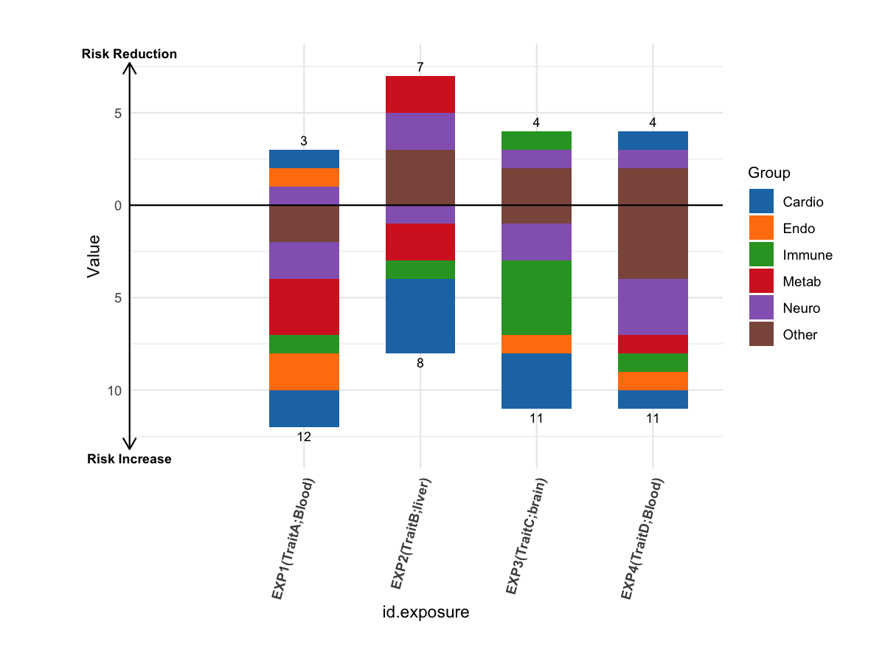

# Stacked side-effect plot (adverse vs benefit)

Create a stacked bar plot showing counts of adverse (OR \> 1) and
benefit (OR \< 1) outcomes per exposure, grouped by category.

## Usage

``` r
plot_side_effect_stack(
  res_phe_all,
  map_file = NULL,
  map_df = NULL,
  map_cols = c(5, 6),
  p_cut = NULL,
  label_with_trait_tissue = TRUE,
  colors = NULL,
  save_path = NULL,
  save_width = 16,
  save_height = 7,
  save_units = "in",
  save_dpi = 300
)
```

## Arguments

- res_phe_all:

  data.frame. Must contain columns:

  - `outcome`: outcome ID used to join mapping.

  - `id.exposure`: exposure ID.

  - `trait`: exposure trait name.

  - `tissue`: exposure tissue name.

  - `p_side_effect`: P value for side effects.

  - `or_side_effect`: odds ratio.

- map_file:

  Character. Path to the mapping Excel file (e.g.
  `UKB_679_mapfile.xlsx`). Ignored if `map_df` is provided.

- map_df:

  data.frame. Optional mapping table with columns `id` and `group`.

- map_cols:

  Integer or character. Columns in `map_file` to use as `id` and
  `group`. Default `c(5, 6)`.

- p_cut:

  Numeric. P-value cutoff. Default is `0.05 / nrow(res_phe_all)`.

- label_with_trait_tissue:

  Logical. If TRUE, append trait and tissue to exposure labels.

- colors:

  Named character vector of colors for each group. If NULL, a default
  palette is generated.

- save_path:

  Character. If provided, save plot via `ggsave()`.

- save_width:

  Numeric. Width passed to `ggsave()`.

- save_height:

  Numeric. Height passed to `ggsave()`.

- save_units:

  Character. Units for `ggsave()`.

- save_dpi:

  Numeric. DPI for `ggsave()`.

## Value

A list with:

- `plot`: ggplot object.

- `data`: list containing `sum`, `long`, `totals`.

- `ttest`: paired t-test result.

## Required columns

- res_phe_all:

  `outcome`, `id.exposure`, `trait`, `tissue`, `p_side_effect`,
  `or_side_effect`.

- map_df:

  `id`, `group`.

## Examples


