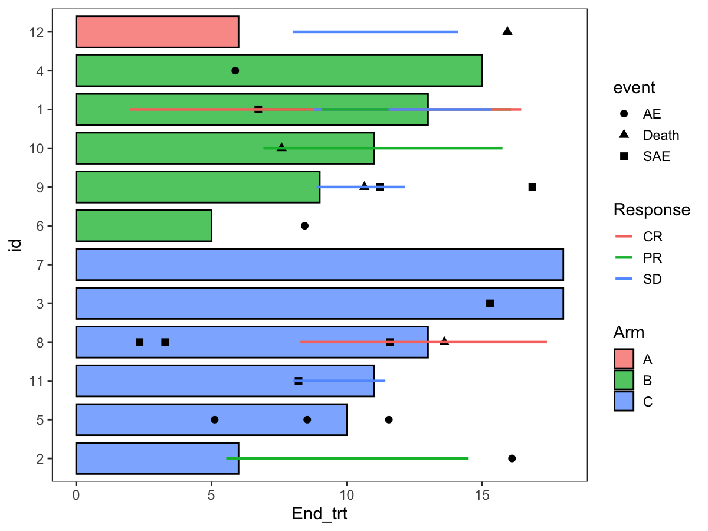

# Swimmer plot for clinical timelines

Create a swimmer plot with optional adverse event points, response
intervals, and treatment continuation arrows.

## Usage

``` r
plot_swimmer(
  arm_df,
  id_col = "id",
  end_col = "End_trt",
  arm_col = "Arm",
  id_order = "Arm",
  stratify = NULL,
  line_color = "black",
  alpha = 0.75,
  width = 0.8,
  base_size = 14,
  ae_df = NULL,
  ae_time_col = "time",
  ae_shape_col = "event",
  ae_color_col = NULL,
  ae_fill = "white",
  ae_size = 2.5,
  response_df = NULL,
  resp_start_col = "Response_start",
  resp_end_col = "Response_end",
  resp_col = "Response",
  resp_size = 1,
  response_points = FALSE,
  response_cont_col = "Continued_response",
  arrow_df = NULL,
  arrow_start_col = "End_trt",
  arrow_cont_col = "Continued_treatment",
  arrow_type = "open",
  arrow_cex = 1,
  scale_fill_values = NULL,
  scale_color_values = NULL,
  scale_shape_values = NULL,
  shape_breaks = NULL,
  save_path = NULL,
  save_width = 7,
  save_height = 5
)
```

## Arguments

- arm_df:

  data.frame with subject timelines (one row per subject).

- id_col:

  Character. Subject ID column in `arm_df`.

- end_col:

  Character. End time column in `arm_df`.

- arm_col:

  Character. Treatment/group column in `arm_df` for fill.

- id_order:

  Character. Ordering for IDs (e.g. `"Arm"`, `"increasing"`).

- stratify:

  Optional character vector of column names in `arm_df` for
  stratification.

- line_color:

  Character. Outline color for bars.

- alpha:

  Numeric. Bar transparency.

- width:

  Numeric. Bar width.

- base_size:

  Numeric. Base font size for theme.

- ae_df:

  Optional data.frame for adverse events.

- ae_time_col:

  Character. Event time column in `ae_df`.

- ae_shape_col:

  Character. Event type column in `ae_df`.

- ae_color_col:

  Optional character. Column in `ae_df` mapped to color.

- ae_fill:

  Character. Fill color for event points.

- ae_size:

  Numeric. Point size for events.

- response_df:

  Optional data.frame for response intervals.

- resp_start_col:

  Character. Response start time column.

- resp_end_col:

  Character. Response end time column.

- resp_col:

  Character. Response category column.

- resp_size:

  Numeric. Line width for responses.

- response_points:

  Logical. Whether to add points at response ends.

- response_cont_col:

  Character. Continued response column for points.

- arrow_df:

  Optional data.frame for treatment continuation arrows.

- arrow_start_col:

  Character. Arrow start time column.

- arrow_cont_col:

  Character. Continuation column (logical/0-1).

- arrow_type:

  Character. Arrow type passed to `swimmer_arrows`.

- arrow_cex:

  Numeric. Arrow size.

- scale_fill_values:

  Optional named vector for fill colors.

- scale_color_values:

  Optional named vector for color scale.

- scale_shape_values:

  Optional vector for shape scale.

- shape_breaks:

  Optional vector of shape breaks.

- save_path:

  Character. If provided, save plot via `ggsave()`.

- save_width:

  Numeric. Width for saved plot.

- save_height:

  Numeric. Height for saved plot.

## Value

A ggplot object.

## Required columns

- arm_df:

  Must contain `id_col`, `end_col`, and `arm_col`.

- ae_df:

  Must contain `id_col`, `ae_time_col`, and `ae_shape_col` (if
  provided).

- response_df:

  Must contain `id_col`, `resp_start_col`, `resp_end_col`, `resp_col`
  (if provided).

- arrow_df:

  Must contain `id_col`, `arrow_start_col`, `arrow_cont_col` (if
  provided).

## Examples


