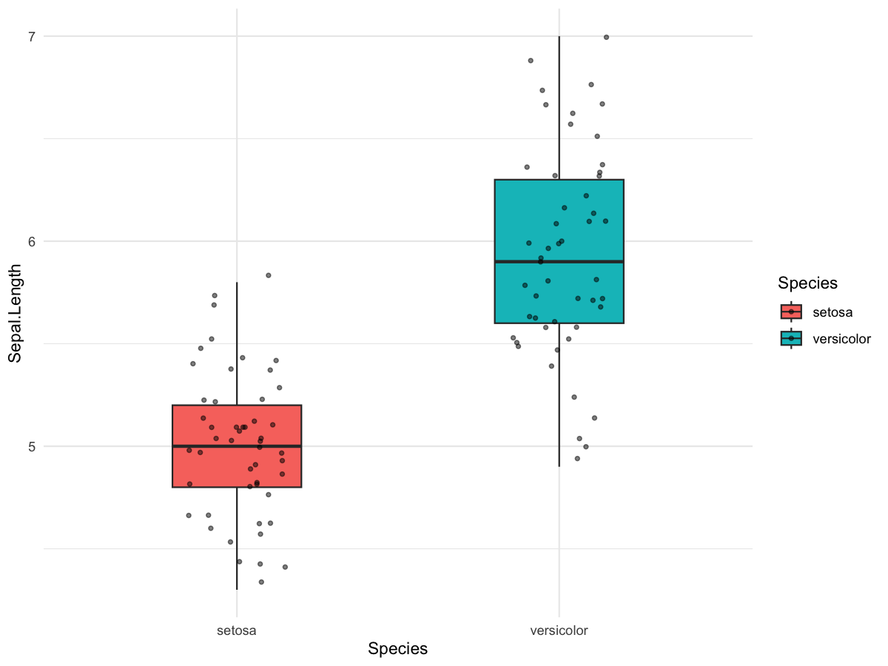

# Symmetric raincloud plot (half violin + box + paired points)

Create a symmetric two-group raincloud plot with half violins, boxplots,
paired points/lines, mean and SD error bars, and optional significance
label.

## Usage

``` r
plot_symmetric_raincloud(
  data,
  group_col = "group",
  value_col = "value",
  id_col = "id",
  group_order = NULL,
  show_signif = TRUE,
  comparisons = NULL,
  palette = NULL,
  save_path = NULL,
  save_width = 9,
  save_height = 6
)
```

## Arguments

- data:

  data.frame containing measurements.

- group_col:

  Character. Group column (must have exactly two groups).

- value_col:

  Character. Numeric value column.

- id_col:

  Character. Paired subject ID column.

- group_order:

  Optional character vector to set group order.

- show_signif:

  Logical. Whether to add `geom_signif`.

- comparisons:

  List. Comparisons for `geom_signif`.

- palette:

  Character vector of colors for groups.

- save_path:

  Character. If provided, save plot via `ggsave()`.

- save_width:

  Numeric. Width for saved plot.

- save_height:

  Numeric. Height for saved plot.

## Value

A ggplot object.

## Required columns

- group_col:

  Two-group factor/character column.

- value_col:

  Numeric measurement column.

- id_col:

  Subject ID for pairing.

## Examples


