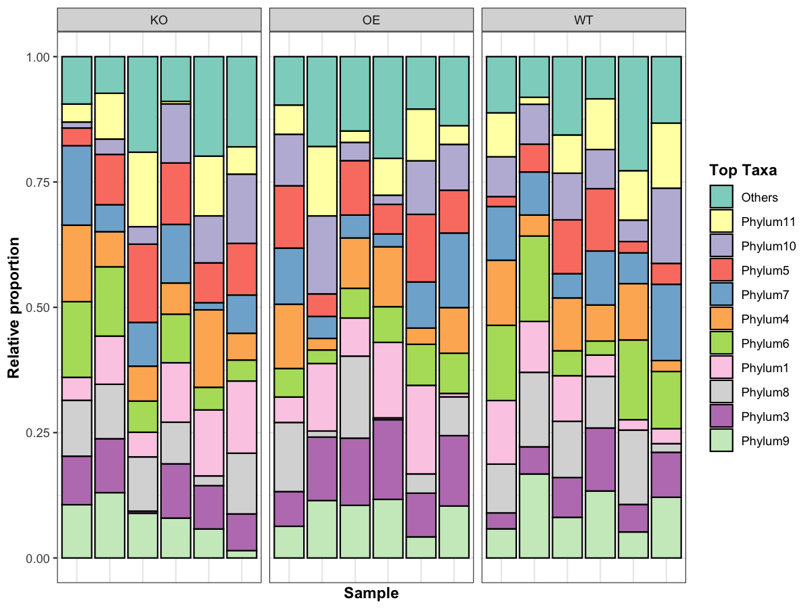

# Stacked bar plot for taxa abundance

Create a relative abundance stacked bar plot (e.g., phylum) across
samples.

## Usage

``` r
plot_taxa_stacked_bar(
  count_table,
  top_n = 10,
  add_others = TRUE,
  group = NULL,
  group_sample_col = "sample",
  group_label_col = "group",
  palette = NULL,
  facet = TRUE,
  show_x = FALSE,
  save_path = NULL,
  save_width = 8,
  save_height = 4
)
```

## Arguments

- count_table:

  Matrix/data.frame with taxa in rows and samples in columns, or a file
  path to a tab-delimited table with row names.

- top_n:

  Integer. Number of top taxa to keep by mean abundance.

- add_others:

  Logical. Whether to add an "Others" category.

- group:

  Optional vector or data.frame for sample grouping. If a vector, length
  must equal number of samples. If a data.frame, provide
  `group_sample_col` and `group_label_col`.

- group_sample_col:

  Character. Sample ID column in `group` data.frame.

- group_label_col:

  Character. Group label column in `group` data.frame.

- palette:

  Character vector of colors for taxa (named or ordered).

- facet:

  Logical. Whether to facet by group.

- show_x:

  Logical. Whether to show x-axis labels.

- save_path:

  Character. If provided, save plot via `ggsave()`.

- save_width:

  Numeric. Width for saved plot.

- save_height:

  Numeric. Height for saved plot.

## Value

A list with:

- `plot`: ggplot object.

- `data`: long-format data used for plotting.

## Required columns

- count_table:

  Rows = taxa; columns = samples.

- group:

  If data.frame, must contain `group_sample_col` and `group_label_col`.

## Examples


