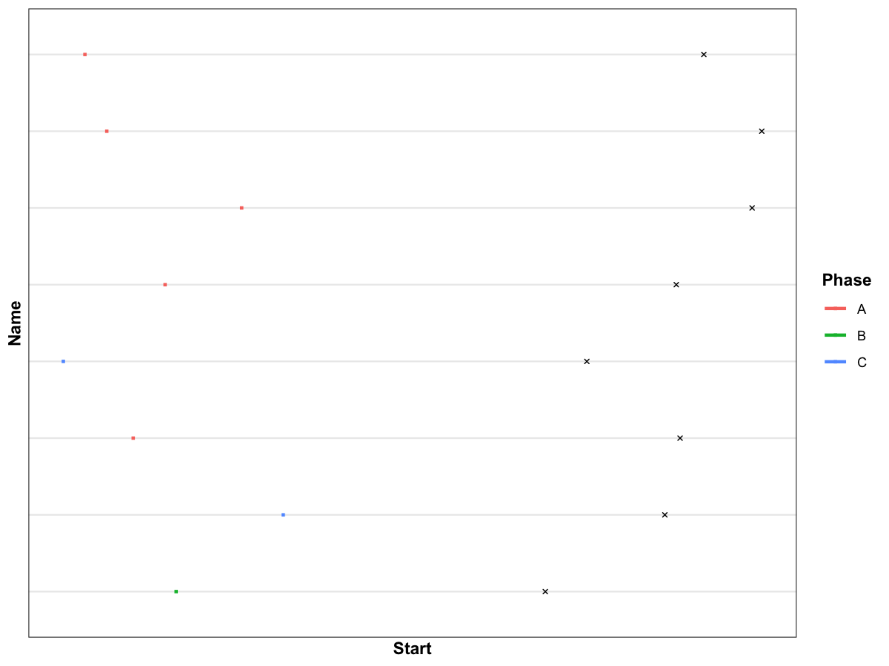

# Timeline plot

Create a simple timeline plot with start/end dates and phases.

## Usage

``` r
plot_timeline(
  data,
  start_col = "Start",
  end_col = "End",
  name_col = "Name",
  phase_col = "Phase",
  colors = NULL,
  wes_palette = NULL,
  date_breaks = "30 year",
  save_path = NULL,
  save_width = 5,
  save_height = 7
)
```

## Arguments

- data:

  data.frame with start/end dates.

- start_col:

  Character. Column name for start date.

- end_col:

  Character. Column name for end date.

- name_col:

  Character. Column name for item name (y axis).

- phase_col:

  Character. Column name for phase/group (color).

- colors:

  Optional named vector of colors for phases.

- wes_palette:

  Optional character. If provided and `wesanderson` is installed, use
  `wesanderson::wes_palette` with this name.

- date_breaks:

  Character. Date breaks for x axis (e.g., "30 year").

- save_path:

  Character. If provided, save plot via `ggsave()`.

- save_width:

  Numeric. Width for saved plot.

- save_height:

  Numeric. Height for saved plot.

## Value

A ggplot object.

## Required columns

- start_col:

  Start date column (Date).

- end_col:

  End date column (Date).

- name_col:

  Item name column.

- phase_col:

  Phase/group column.

## Examples


