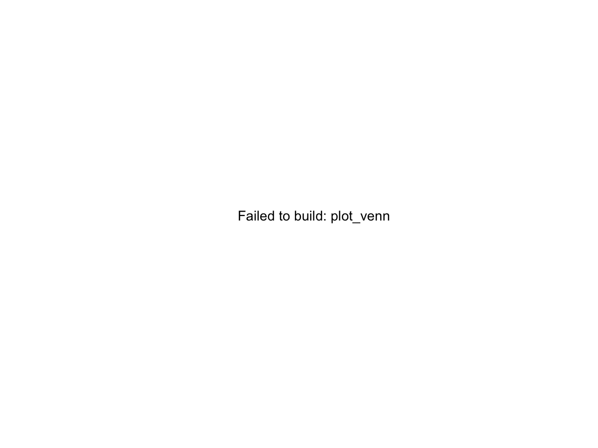

# Venn Diagram for 2 or 3 Gene Sets

Create a Venn diagram for two or three gene sets and return both the
plot object and the intersection lists.

## Usage

``` r
plot_venn(
  sets,
  label_counts = TRUE,
  fill = NULL,
  alpha = 0.5,
  scaled = FALSE,
  ...
)
```

## Arguments

- sets:

  A named list of character vectors (2 or 3 sets).

- label_counts:

  Logical; append set sizes to category labels.

- fill:

  Fill colors for the sets. Use \`"auto"\` or \`NULL\` to choose a
  palette automatically.

- alpha:

  Fill transparency.

- scaled:

  Logical; whether to scale circle sizes by set size.

- ...:

  Additional arguments passed to \`VennDiagram::venn.diagram\`.

## Value

A list with:

- plot:

  A grid grob returned by \`VennDiagram::venn.diagram\`.

- intersections:

  A named list of intersection regions.

- sets:

  The cleaned input sets (unique, non-NA).

## Required inputs

- sets:

  Named list of 2 or 3 character vectors.

## Examples


