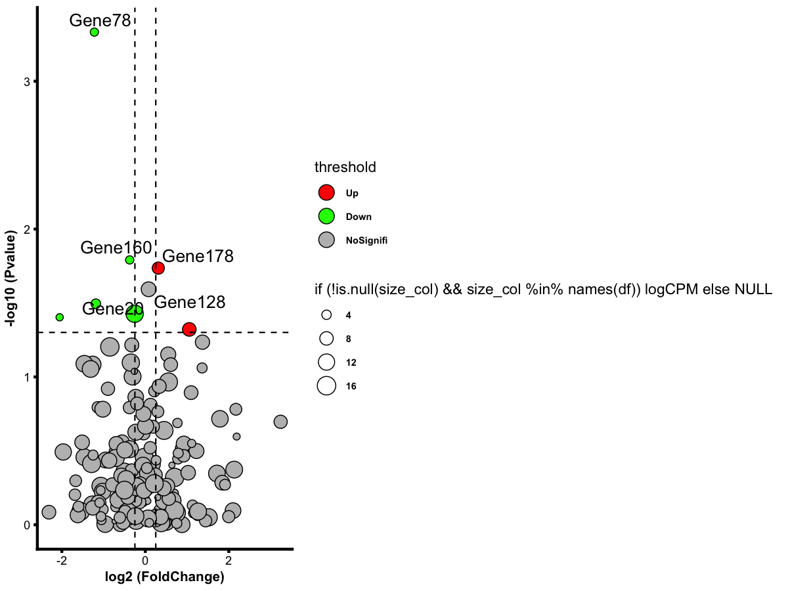

# Advanced volcano plot

Create a volcano plot with size mapped to expression (e.g. logCPM),
threshold-based coloring, and optional gene labels.

## Usage

``` r
plot_volcano_advanced(
  data,
  logfc_col = NULL,
  p_col = NULL,
  gene_col = NULL,
  size_col = "logCPM",
  p_cutoff = 0.05,
  lfc_cutoff = 0.25,
  label_genes = NULL,
  label_p_cutoff = NULL,
  label_top = 5,
  colors = c(Up = "#fe0000", Down = "#13fc00", NoSignifi = "#bdbdbd"),
  size_range = c(2, 16),
  save_path = NULL,
  save_width = 5,
  save_height = 4
)
```

## Arguments

- data:

  A data.frame containing differential results.

- logfc_col:

  Character. Column name for log2 fold-change.

- p_col:

  Character. Column name for p-value.

- gene_col:

  Character. Column name for gene symbol/ID.

- size_col:

  Character. Column name for point size (e.g. logCPM). If NULL, point
  size is fixed.

- p_cutoff:

  Numeric. P-value cutoff for significance.

- lfc_cutoff:

  Numeric. Absolute log2 fold-change cutoff.

- label_genes:

  Optional vector of genes to label. If NULL, labels are selected by
  `label_p_cutoff` or `label_top`.

- label_p_cutoff:

  Numeric. Label genes with p-value below this cutoff. Set NULL to
  disable.

- label_top:

  Integer. Label top N most significant genes (by p-value). Used only
  when `label_genes` and `label_p_cutoff` are NULL.

- colors:

  Named vector for `Up`, `Down`, `NoSignifi`.

- size_range:

  Numeric length-2. Size range for points if `size_col` is provided.

- save_path:

  Character. If provided, save plot via `ggsave()`.

- save_width:

  Numeric. Width for saved plot.

- save_height:

  Numeric. Height for saved plot.

## Value

A list with:

- `plot`: ggplot object.

- `data`: data.frame with added `threshold` and `logP`.

## Required columns

- logFC:

  Log2 fold-change (or set `logfc_col`).

- P_value:

  P-value (or set `p_col`).

- gene:

  Gene ID/symbol (or set `gene_col`).

- logCPM:

  Optional size variable (or set `size_col`).

## Examples


