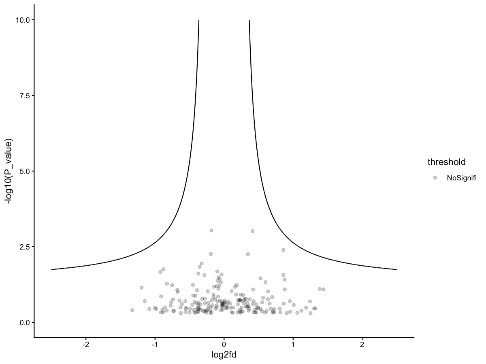

# Volcano plot with hyperbolic threshold

Create a volcano plot with a hyperbolic significance curve.

## Usage

``` r
plot_volcano_hyperbola(
  data,
  log2fd_cut = 0.25,
  p_cut = 0.05,
  curve_max = 3,
  colors = c(Up = "#FC4E2A", Down = "#4393C3", NoSignifi = "#00000033"),
  xlim = c(-2.5, 2.5),
  ylim = c(0, 10),
  label = FALSE,
  label_col = "gene",
  save_path = NULL,
  save_width = 6,
  save_height = 5
)
```

## Arguments

- data:

  data.frame with `log2fd` and `P_value` columns.

- log2fd_cut:

  Numeric. Log2 fold-change threshold.

- p_cut:

  Numeric. P-value cutoff.

- curve_max:

  Numeric. Max x for curve generation.

- colors:

  Named vector for Up/Down/NoSignifi colors.

- xlim:

  Numeric length-2. X-axis limits.

- ylim:

  Numeric length-2. Y-axis limits.

- label:

  Logical. Whether to add gene labels.

- label_col:

  Character. Column name for labels.

- save_path:

  Character. If provided, save plot via `ggsave()`.

- save_width:

  Numeric. Width for saved plot.

- save_height:

  Numeric. Height for saved plot.

## Value

A ggplot object.

## Required columns

- log2fd:

  Log2 fold-change.

- P_value:

  P-value.

- gene:

  Optional label column (or set `label_col`).

## Examples


